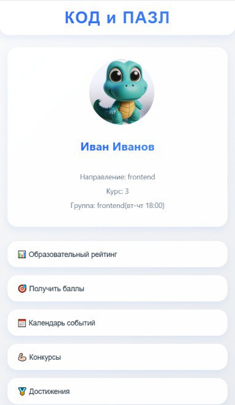

# 🚀 КОД ПАЗЛ

<div align="center">
  
</div>

## 📋 О проекте

**КОД ПАЗЛ** — это современное веб-приложение, разработанное с использованием React и TypeScript. Приложение предоставляет интерактивный интерфейс с богатым функционалом для пользователей.

## ✨ Особенности

- 🔄 Реактивный интерфейс с использованием React 19
- 📊 Визуализация данных с помощью Recharts
- 📅 Интеграция с календарем (FullCalendar)
- 📱 Поддержка Telegram Apps SDK
- 🎨 Современный дизайн с использованием Tailwind
- 📱 Полностью адаптивный интерфейс для мобильных устройств

## 🛠️ Технологии

<div align="center">

| 🔧 Технология | 📚 Версия |
|--------------|-----------|
| React        | ^19.0.0   |
| TypeScript   | ~5.7.2    |
| Vite         | ^6.2.0    |
| MobX         | ^6.13.6   |
| Recharts     | ^2.15.1   |

</div>

## 🚀 Установка и запуск

```bash
# Клонирование репозитория
git clone <url-репозитория>

# Переход в директорию проекта
cd mini-app

# Установка зависимостей
npm install

# Запуск в режиме разработки
npm run dev

# Сборка для продакшена
npm run build

# Предпросмотр продакшен-сборки
npm run preview
```

## 📁 Структура проекта

```
mini-app/
├── src/
│   ├── app/         # Основные файлы приложения
│   ├── assets/      # Статические ресурсы
│   ├── components/  # React компоненты
│   ├── data/        # Данные и константы
│   ├── interfaces/  # TypeScript интерфейсы
│   ├── store/       # MobX хранилища
│   └── img/         # Изображения для приложения
├── img/             # Изображения для документации
```

## 🔧 Скрипты

- `npm run dev` - Запуск сервера разработки
- `npm run build` - Сборка проекта для продакшена
- `npm run lint` - Проверка кода с помощью ESLint
- `npm run preview` - Предпросмотр продакшен-сборки

## 📱 Адаптивность

Приложение полностью адаптировано для работы на различных устройствах:

- 📱 Мобильные телефоны (до 480px)
- 📱 Планшеты (до 768px)
- 💻 Десктопы (более 768px)

Реализованы следующие адаптивные функции:
- Динамическое изменение размеров компонентов
- Оптимизированный календарь для мобильных устройств
- Адаптивные графики и визуализации данных
- Оптимизированная навигация для маленьких экранов
---

<div align="center">
  <p>Разработано с ❤️</p>
</div>
